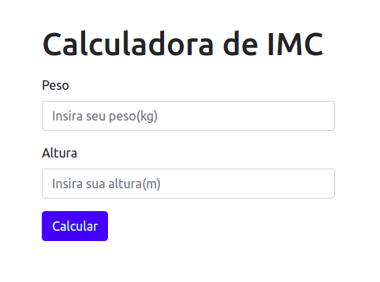

# Calculadora IMC :weight_lifting: 

### Formulário

### Resultado

### Silgas

- IMC - Índice de Massa Corporal
- OMS - Organização Mundial da Saúde
- HTTP - Hypertext Transfer Protocol

## Desrição

Servidor Node HTTP que calcula IMC conforme padrão estabelecido pela da OMS.

## Requisitos
- Navegador 
- Node 14.15.*

## Como rodar
- Na raiz do projeto rode o comando `node server.js`
- Em seguida acesse o endereço + porta fornecida pela aplicação no seu navegador 

### Referências
- https://bvsms.saude.gov.br/bvs/dicas/215_obesidade.html

## Importante :warning:
- Essa calculadora não substitui o trabalho de um nutricionista.